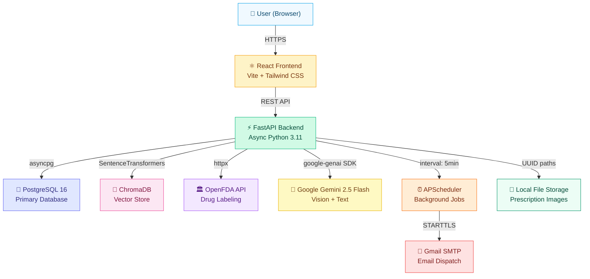
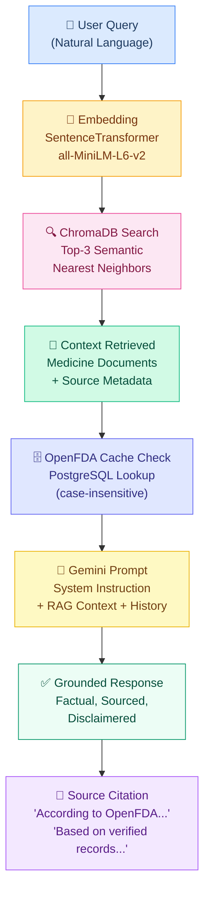

# MediGuide AI — Development Phases & Architecture


> **MediGuide AI** is an intelligent prescription management platform that combines multimodal AI (Gemini Vision + custom YOLOv8), a hybrid medical knowledge base (OpenFDA + RAG), and automated medication reminders to transform handwritten prescriptions into actionable, verified healthcare data.

---

## Table of Contents

| #   | Phase                                         | Focus Area                      |
| --- | --------------------------------------------- | ------------------------------- |
| 1   | [Foundation & Core Infrastructure](#phase-1)  | Backend scaffold, Auth, ORM     |
| 2   | [AI Extraction Pipeline](#phase-2)            | Gemini OCR, YOLO, Validation    |
| 3   | [Dashboard & Schedule Management](#phase-3)   | UI, APScheduler, Reminders      |
| 4   | [Medical Assistant & Medicine Library](#phase-4) | AI Chatbot, Medicine search  |
| 5   | [Hybrid Medical Knowledge Base](#phase-5)     | OpenFDA, ChromaDB, RAG          |
| 6   | [Database Migration & Schema Updates](#phase-6) | Extended models, RAG injection |
| 7   | [Docker Deployment & Productionization](#phase-7) | Dockerfiles, Compose, CI    |
| 8   | [Final Polish & Completion](#phase-8)         | Custom YOLO, Email, XAI         |

---

<a id="phase-1"></a>

## Phase 1 — Foundation & Core Infrastructure

> _Goal: Establish a production-ready full-stack scaffold with authentication, database, and file storage._

### Backend — FastAPI + Async SQLAlchemy

| Component              | Implementation                                                                 |
| ---------------------- | ------------------------------------------------------------------------------ |
| **Framework**          | FastAPI with `uvicorn` ASGI server                                             |
| **ORM**                | SQLAlchemy 2.0 with fully `async` session support via `asyncpg` / `aiosqlite` |
| **Database**           | PostgreSQL 16 (primary) with automatic SQLite fallback for local dev           |
| **Config**             | Pydantic Settings (`BaseSettings`) loading from `.env` — single `settings` singleton |

- Centralized configuration in `config.py` with 20+ configurable knobs including feature flags (`use_gemini`, `use_yolo`, `use_rag`, `use_email_reminders`, etc.)
- Automatic `cors_origins` parsing supporting both JSON arrays and plain strings
- Database engine factory with PostgreSQL → SQLite graceful fallback and connection pooling

### Frontend — React + Vite + Tailwind CSS

| Component        | Details                                                      |
| ---------------- | ------------------------------------------------------------ |
| **Build Tool**   | Vite for sub-second HMR and optimized production builds      |
| **UI Framework** | React 18 with functional components and hooks                |
| **Styling**      | Tailwind CSS with custom medical-themed colour palette       |
| **Routing**      | React Router v6 with protected route wrappers                |
| **State**        | Context API (`AuthContext`) for JWT token lifecycle           |

13 page components: `Home`, `Login`, `Register`, `Dashboard`, `PrescriptionUpload`, `PrescriptionList`, `PrescriptionDetail`, `MedicationSchedule`, `MedicalHistory`, `MedicineLibrary`, `AIAssistant`, `Architecture`, `About`

### Authentication — JWT (Access + Refresh Tokens)

```
POST /api/auth/register   → Create user → Issue access + refresh tokens
POST /api/auth/login      → Verify credentials → Issue token pair
POST /api/auth/refresh    → Rotate refresh token → New access token
```

- **Access Token**: HS256-signed, 15-minute expiry (configurable)
- **Refresh Token**: 7-day expiry, stored httpOnly
- Passwords hashed with `bcrypt` via `passlib`
- `get_current_user` dependency injection on all protected routes

### ORM Models

| Model                  | Purpose                              | Key Fields                                                 |
| ---------------------- | ------------------------------------ | ---------------------------------------------------------- |
| `User`                 | Patient accounts                     | email, hashed_password, full_name, phone, medical_profile  |
| `Doctor`               | Doctor records (extracted)           | name, specialization, license_number, contact              |
| `Medicine`             | Shared medicine knowledge cache      | name, generic_name, category, side_effects, interactions   |
| `Prescription`         | Uploaded prescription images + data  | image_url, status, raw_extraction, validated_data          |
| `PrescriptionMedicine` | Individual medicines per Rx          | medicine_name, dosage, frequency, timing, duration_days    |
| `MedicationSchedule`   | Generated dosing schedules           | user_id, start_date, end_date, time_slots, is_active       |
| `Reminder`             | Per-schedule alarm entries           | schedule_id, reminder_time, is_enabled                     |
| `Notification`         | Dispatched alert log                 | user_id, reminder_id, type, title, body, status            |
| `MedicalHistory`       | Timeline events                      | user_id, event_type, description, date                     |
| `MedicationLog`        | Adherence tracking                   | schedule_id, taken_at, status                              |
| `AIExtractionLog`      | Audit trail for AI pipeline runs     | prescription_id, model_used, confidence_score, status      |

### Infrastructure Utilities

- **CORS Middleware** — Configurable origin whitelist with credentials support
- **Exception Handlers** — Structured JSON error responses for `NotFoundError`, `AIExtractionError`, `ValidationError`, and generic 500s
- **Local File Storage** (`StorageService`) — Filesystem-backed image upload/download with UUID-based path generation

---

<a id="phase-2"></a>

## Phase 2 — AI Extraction Pipeline

> _Goal: Build a multi-stage AI pipeline that converts prescription images into structured, validated medical data._

### Pipeline Overview

```
Image Upload → Preprocessing → YOLO Detection → Gemini OCR → Rule Validation → Confidence Scoring
```

### Stage 1: Image Preprocessing (`preprocessing.py`)

Four-step enhancement pipeline using OpenCV:

| Step              | Technique                    | Purpose                                   |
| ----------------- | ---------------------------- | ----------------------------------------- |
| **Grayscale**     | `cv2.cvtColor(BGR2GRAY)`     | Remove colour noise                       |
| **Denoise**       | `cv2.fastNlMeansDenoising()` | Reduce scan/photo artifacts               |
| **CLAHE**         | Adaptive histogram EQ        | Enhance contrast on faded text            |
| **Threshold**     | Otsu binarization (optional) | Sharpen text boundaries (skippable flag)  |

Returns processed `bytes` in JPEG format, preserving colour detail when `skip_threshold=True`.

### Stage 2: YOLOv8 Layout Detection (`yolo.py`)

- Loads custom-trained `best.pt` weights from `ai/yolo/models/`
- Detects prescription layout regions: **doctor_info**, **patient_info**, **date**, **medicine_blocks**, **signature**
- Returns bounding boxes with confidence scores as `Dict[str, {"bbox": [x1,y1,x2,y2], "confidence": float}]`
- **Graceful fallback**: If weights are missing or `ultralytics` not installed, returns `{}` and full-image processing continues seamlessly

### Stage 3: Gemini 2.5 Flash OCR + Extraction (`extraction.py`)

```python
class GeminiExtractor:
    MODEL_NAME = "gemini-2.5-flash"
    # Temperature: 0.1 (near-deterministic for structured extraction)
    # Response: application/json (forced JSON output mode)
    # Max Retries: 3 with exponential backoff (2s, 4s, 6s)
```

- Sends preprocessed image + few-shot extraction prompt to Gemini Vision API
- Prompt defines strict JSON schema: `doctor_name`, `patient_name`, `prescription_date`, `diagnosis`, `medicines[]` (each with `medicine_name`, `dosage`, `frequency`, `timing`, `duration_days`, `special_instructions`)
- Automatic markdown code-fence stripping for robust JSON parsing
- Extraction timing logged in milliseconds

### Stage 4: Rule Engine Validation (`validation.py`)

| Rule                     | Check                                                                  | Penalty     |
| ------------------------ | ---------------------------------------------------------------------- | ----------- |
| **Dosage Range**         | Known drugs checked against `_DOSAGE_RANGES` dictionary (mg bounds)    | −0.15/warning |
| **Duplicate Detection**  | Same medicine name appearing twice in one prescription                 | −0.30       |
| **Missing Dosage**       | No dosage string extracted                                             | −0.20       |
| **Missing Timing**       | No timing information                                                  | −0.10       |
| **Missing Frequency**    | No frequency information                                               | −0.10       |
| **Suspicious Duration**  | Duration > 100 days                                                    | −0.30       |
| **Missing Core Fields**  | Each missing: doctor_name, patient_name, date, diagnosis               | −0.10/each  |
| **No Medicines**         | Zero medicines extracted                                               | −0.20       |

### Stage 5: Confidence Scoring

- Starts at `1.0` and applies cumulative penalties per rule
- Per-medicine confidence (`MedicineExtracted.confidence`) and overall prescription confidence (`ExtractionResult.confidence_score`)
- Clamped to `[0.0, 1.0]` range
- Low-confidence extractions flagged for mandatory human review

### AI Extraction Logging (`AIExtractionLog`)

Every pipeline run creates an audit record tracking: `model_used`, `raw_response`, `confidence_score`, `status` (started → success/failed), `error_message`, and timestamps.

---

<a id="phase-3"></a>

## Phase 3 — Dashboard & Schedule Management

> _Goal: Build the patient-facing UI and automated medication scheduling system._

### Interactive Dashboard (`Dashboard.jsx`)

- **Statistics Cards**: Total prescriptions, active medications, upcoming reminders, adherence rate
- **Recent Prescriptions**: Sortable list with status badges (`pending`, `processing`, `waiting_for_user`, `verified`, `failed`)
- **Quick Actions**: Upload new prescription, view schedules, open AI assistant
- **Real-time Status Tracking**: Prescription pipeline stages displayed as a progress stepper

### Prescription Management

| Page                      | Features                                                                                          |
| ------------------------- | ------------------------------------------------------------------------------------------------- |
| `PrescriptionUpload.jsx`  | Drag-and-drop image upload, real-time pipeline progress (7 stages), automatic redirect on success |
| `PrescriptionList.jsx`    | Paginated list, status filters, search, delete with confirmation                                  |
| `PrescriptionDetail.jsx`  | Side-by-side: original image + extracted data, editable fields, human verification workflow        |

### Human-in-the-Loop Verification

```
AI Extraction → "waiting_for_user" → User Reviews/Edits → "verified" → Schedules Generated
```

- Users can edit extracted medicine names, dosages, frequencies before confirming
- Corrections are logged for model improvement feedback loop
- Verification triggers `MedicationIntelligenceService` enrichment + auto-schedule generation

### APScheduler Background Task (`scheduler.py`)

```python
# Runs every 5 minutes via AsyncIOScheduler
scheduler.add_job(
    _check_reminders,
    trigger="interval",
    minutes=5,
    id="reminder_checker",
)
```

- Scans `MedicationSchedule` + `Reminder` tables for due alerts
- 30-minute activation window per reminder slot
- De-duplicates: skips if notification already sent today for that slot

### Schedule Generation (`schedule_service.py`)

- Auto-creates `MedicationSchedule` entries from verified prescriptions
- Calculates `end_date` from `start_date + duration_days`
- Generates `Reminder` entries with appropriate time slots (morning/afternoon/evening)
- Links to `PrescriptionMedicine` for full traceability

### Local Alarm Notifications

- **Primary**: `winsound.Beep()` — alternating 1000Hz/1500Hz tone sequence (3 cycles)
- **Fallback**: `pygame.mixer` (if winsound unavailable on non-Windows)
- **Console**: Formatted notification payload printed to terminal
- All alarms dispatched in background `threading.Thread` to avoid blocking

### Medical History Timeline (`MedicalHistory.jsx`)

- Chronological view of prescriptions, medication changes, and health events
- Filterable by event type and date range
- Links back to original prescription records

---

<a id="phase-4"></a>

## Phase 4 — Medical Assistant & Medicine Library

> _Goal: Add an AI-powered chatbot and searchable drug reference library._

### AI Medical Assistant (`assistant_service.py` + `AIAssistant.jsx`)

**System Prompt Architecture**:
```
┌───────────────────────────────────────────────┐
│  MediGuide AI Assistant System Prompt         │
├───────────────────────────────────────────────┤
│  1. Role: Empathetic medication specialist    │
│  2. User's Prescription Context (DB)          │
│  3. RAG Knowledge Base Context (ChromaDB)     │
│  4. Source Attribution Guidelines             │
│  5. Safety Disclaimer Mandate                 │
└───────────────────────────────────────────────┘
```

- Powered by **Gemini 2.5 Flash** (`temperature=0.7` for conversational tone)
- Injects user's **active prescriptions** with full medication details (dosage, frequency, timing, duration, special instructions)
- Injects **verified medical knowledge** from the RAG pipeline with source attribution
- Conversation history maintained across messages (`user`/`model` role mapping)
- **Mandatory safety disclaimer** appended to every response

### Medicine Library (`MedicineLibrary.jsx` + `medicines.py` router)

- Full-text search across medicine names, categories, and generic names
- Card-based display with expandable details
- Fields: name, generic name, category, description, side effects, interactions, contraindications
- **Verified badge** for OpenFDA-sourced entries vs. AI-generated

### Conversation History

- Frontend maintains conversation array in component state
- Full history sent with each request for multi-turn context
- Gemini `contents[]` formatted with proper `user`/`model` role alternation

---

<a id="phase-5"></a>

## Phase 5 — Hybrid Medical Knowledge Base

> _Goal: Build a three-tier knowledge acquisition system: Cache → OpenFDA → Gemini, backed by vector search._

### Knowledge Acquisition Waterfall

```
┌──────────────────────────────────────────────────────────────┐
│                   Medicine Query                             │
│                      ↓                                       │
│  ┌─ Tier 1: PostgreSQL Cache ──────────────────────────────┐ │
│  │  SELECT * FROM medicines WHERE name ILIKE query         │ │
│  │  ✅ Hit → Return immediately                            │ │
│  └─────────────────────────────────────────────────────────┘ │
│                      ↓ miss                                  │
│  ┌─ Tier 2: OpenFDA Drug Labeling API ─────────────────────┐ │
│  │  GET /drug/label.json?search=openfda.generic_name:...   │ │
│  │  Parses: description, adverse_reactions, interactions,  │ │
│  │          contraindications, warnings, dosage_admin      │ │
│  │  ✅ Hit → Cache to DB + Index to ChromaDB → Return      │ │
│  └─────────────────────────────────────────────────────────┘ │
│                      ↓ miss / error                          │
│  ┌─ Tier 3: Gemini AI Generation ──────────────────────────┐ │
│  │  Structured prompt: "You are a clinical pharmacologist" │ │
│  │  JSON response: generic_name, category, description,   │ │
│  │                 side_effects, interactions, etc.        │ │
│  │  ✅ Generated → Cache to DB + Index to ChromaDB         │ │
│  └─────────────────────────────────────────────────────────┘ │
└──────────────────────────────────────────────────────────────┘
```

### OpenFDA Drug Labeling API Client (`openfda.py`)

| Feature              | Detail                                                                    |
| -------------------- | ------------------------------------------------------------------------- |
| **Endpoint**         | `https://api.fda.gov/drug/label.json`                                     |
| **Search Strategy**  | Dual search: `openfda.generic_name` OR `openfda.brand_name`              |
| **HTTP Client**      | `httpx.AsyncClient` with 10-second timeout                               |
| **API Key**          | Optional — used for higher rate limits when configured                    |
| **Parsing**          | Extracts 12 fields from FDA label data                                    |
| **List Truncation**  | Side effects/warnings capped at 10 items to prevent DB bloat             |
| **Source Tag**       | All OpenFDA records tagged `source="OpenFDA"` for verified badge display |

### ChromaDB Vector Embeddings — RAG Service (`rag_service.py`)

```python
# Embedding Model: all-MiniLM-L6-v2 (384-dimensional sentence embeddings)
# Storage: PersistentClient at ./chroma_db
# Collection: "medicine_knowledge"
sentence_transformer_ef = SentenceTransformerEmbeddingFunction(
    model_name="all-MiniLM-L6-v2"
)
```

**Indexing**: Each medicine generates a rich text document combining:
`name + generic_name + category + description + side_effects + contraindications + warnings + interactions + usage_instructions`

**Retrieval**: Top-3 semantic results per query, with source metadata (`OpenFDA` vs `AI-Generated`) attached for citation.

### MedicationIntelligenceService (`medication_intelligence.py`)

The orchestration layer that ties it all together:

1. **Normalizes** medicine name (title-case, whitespace cleanup)
2. **Cache check** — case-insensitive PostgreSQL lookup
3. **OpenFDA fetch** — async API call with full label parsing
4. **Gemini fallback** — structured JSON generation with clinical pharmacologist prompt
5. **Persist** — creates `Medicine` row with all pharmacological fields
6. **RAG index** — upserts the medicine document into ChromaDB for future retrieval
7. **Source tracking** — records whether data came from `OpenFDA`, `AI-Generated (Gemini)`, or `System Default`

---

<a id="phase-6"></a>

## Phase 6 — Database Migration & Schema Updates

> _Goal: Extend the data model to support full pharmacological data and integrate RAG into the assistant._

### Extended Medicine Model

New pharmacological fields added to the `Medicine` ORM model:

| Field                | Type          | Source                    |
| -------------------- | ------------- | ------------------------- |
| `generic_name`       | `String`      | OpenFDA / Gemini          |
| `brand_names`        | `JSON (list)` | OpenFDA                   |
| `dosage_forms`       | `JSON (list)` | OpenFDA                   |
| `contraindications`  | `JSON (list)` | OpenFDA / Gemini          |
| `warnings`           | `JSON (list)` | OpenFDA / Gemini          |
| `pregnancy_category` | `String`      | OpenFDA                   |
| `storage`            | `String`      | OpenFDA                   |
| `usage_instructions` | `Text`        | OpenFDA / Gemini          |
| `source`             | `String`      | System-assigned watermark |

### Custom Schema Reset Tool (`reset_db.py`)

- Drops and recreates all tables using `Base.metadata.create_all()`
- Used during development to apply schema changes without full migration tooling
- Preserves seed data insertion hooks

### RAG Context Injection into Assistant

The `AssistantService` system prompt now includes two dynamic context blocks:

```
--- USER'S CURRENT PRESCRIPTIONS ---
{medication context from DB}

--- VERIFIED MEDICAL KNOWLEDGE BASE (RAG) ---
{ChromaDB semantic search results with source attribution}
```

Priority rules:
1. If RAG context contradicts Gemini's internal knowledge → **trust RAG**
2. Source attribution: `"According to the OpenFDA database..."` or `"Based on verified medical records..."`

### Verified Badges in UI

- Medicine Library cards display a **green verified badge** (✓ OpenFDA) or **amber AI badge** for Gemini-generated entries
- Source metadata flows from `Medicine.source` → API response → frontend rendering

---

<a id="phase-7"></a>

## Phase 7 — Docker Deployment & Productionization

> _Goal: Containerize the full stack for reproducible one-command deployment._

### Container Architecture

| Service      | Image                  | Port  | Purpose                        |
| ------------ | ---------------------- | ----- | ------------------------------ |
| `db`         | `postgres:16-alpine`   | 5432  | Primary database               |
| `backend`    | Custom (python:3.11-slim) | 8000 | FastAPI application server     |
| `frontend`   | Custom (multi-stage)   | 5173→80 | Nginx-served React SPA       |

### Backend Dockerfile

```dockerfile
FROM python:3.11-slim
# System deps for OpenCV, psycopg2, etc.
# pip install from requirements.txt
# Uvicorn entrypoint on port 8000
```

### Frontend Dockerfile (Multi-Stage Build)

```dockerfile
# Stage 1: Build
FROM node:18-alpine AS builder
RUN npm ci && npm run build

# Stage 2: Serve
FROM nginx:alpine
COPY --from=builder /app/dist /usr/share/nginx/html
# Custom nginx.conf for SPA routing (try_files)
```

### docker-compose.yml Orchestration

```yaml
services:
  db:        # PostgreSQL 16 with health check (pg_isready)
  backend:   # Depends on db (service_healthy)
  frontend:  # Depends on backend
volumes:
  mediguide_pgdata:   # Persistent database storage
  ./backend/chroma_db # Persistent vector DB storage
```

**Environment Variables** passed through compose:
- `DATABASE_URL` — PostgreSQL connection string
- `GEMINI_API_KEY` — Google AI API key
- `OPENFDA_API_KEY` — FDA data access
- `JWT_SECRET_KEY` — Token signing secret
- `USE_REAL_MEDICINE_DATABASE` — Enable OpenFDA integration
- `USE_RAG` — Enable ChromaDB vector search

### .dockerignore Optimization

Excludes `node_modules/`, `__pycache__/`, `.git/`, `*.pyc`, `.env`, and IDE config to minimize build context and image size.

---

<a id="phase-8"></a>

## Phase 8 — Final Polish & Completion

> _Goal: Train a custom YOLO model, add explainability, enable real email, and complete end-to-end verification._

### Custom YOLOv8 Model Training

| Parameter        | Value                                                       |
| ---------------- | ----------------------------------------------------------- |
| **Base Model**   | YOLOv8n (nano — optimized for inference speed)              |
| **Dataset**      | Roboflow prescription layout dataset                        |
| **Classes**      | `doctor_info`, `patient_info`, `date`, `medicine_block`, `signature` |
| **Output**       | `ai/yolo/models/best.pt`                                    |
| **Integration**  | Hot-loaded by `YOLODetector.__init__()` if weights exist    |

### Explainable AI (XAI) — Frontend Overlays

- YOLO bounding boxes rendered as **coloured overlays** on the original prescription image
- Each region labeled with its class name and **confidence percentage**
- Per-medicine confidence bars in the extraction results view
- Rule engine warnings displayed as amber alert chips

### Real SMTP Email Reminders (`reminder_service.py`)

```python
def send_email_reminder(email_to, subject, body):
    # Gmail SMTP (smtp.gmail.com:587, STARTTLS)
    # HTML template with MediGuide branding
    # Retry logic: 3 attempts with 2-second backoff
    # Background thread dispatch (non-blocking)
```

| Feature             | Detail                                                |
| ------------------- | ----------------------------------------------------- |
| **Provider**        | Gmail SMTP (`smtp.gmail.com:587`)                     |
| **Security**        | STARTTLS encryption                                   |
| **Format**          | Multipart (plain text + branded HTML template)        |
| **Retry Logic**     | 3 attempts with 2-second delay between retries       |
| **Execution**       | Background `threading.Thread(daemon=True)` — non-blocking |
| **Feature Flag**    | `use_email_reminders` toggle in settings              |

### End-to-End Pipeline Verification

The complete verified flow:

```
1. User uploads prescription image
2. Image preprocessed (grayscale, denoise, CLAHE)
3. YOLOv8 detects layout regions (if model available)
4. Gemini 2.5 Flash extracts structured JSON
5. Rule engine validates dosages, frequencies, duplicates
6. Confidence score calculated (0.0 – 1.0)
7. User reviews and verifies extracted data (HITL)
8. MedicationIntelligence enriches each medicine:
   a. PostgreSQL cache check
   b. OpenFDA API query
   c. Gemini fallback generation
9. Medicines indexed into ChromaDB for RAG
10. Schedules auto-generated with reminders
11. APScheduler dispatches alarms + emails on schedule
12. AI Assistant answers queries with RAG-grounded responses
```

---

## Architecture Diagrams

### High-Level System Architecture



### Mid-Level AI Extraction Pipeline

```mermaid
graph LR
    Upload["📤 Image Upload<br/>(JPEG/PNG)"]
    Preprocess["🖼️ Preprocessing<br/>Grayscale → Denoise<br/>→ CLAHE → Threshold"]
    YOLO["🎯 YOLO Detection<br/>Layout Regions<br/>(Graceful Fallback)"]
    Gemini["🤖 Gemini OCR<br/>Vision + Few-Shot<br/>JSON Extraction"]
    Rules["📋 Rule Validation<br/>Dosage Ranges<br/>Duplicate Check"]
    Confidence["📊 Confidence<br/>Scoring Engine<br/>(0.0 – 1.0)"]
    HITL["👤 Human<br/>Verification<br/>(Edit & Confirm)"]
    Schedule["📅 Schedule<br/>Generation<br/>+ Reminders"]
    Database["🐘 Database<br/>Persist Records<br/>+ Knowledge Base"]

    Upload --> Preprocess
    Preprocess --> YOLO
    YOLO --> Gemini
    Gemini --> Rules
    Rules --> Confidence
    Confidence --> HITL
    HITL --> Schedule
    Schedule --> Database

    style Upload fill:#dbeafe,stroke:#3b82f6,color:#1e3a5f
    style Preprocess fill:#fef3c7,stroke:#f59e0b,color:#78350f
    style YOLO fill:#d1fae5,stroke:#10b981,color:#064e3b
    style Gemini fill:#fef9c3,stroke:#eab308,color:#713f12
    style Rules fill:#fee2e2,stroke:#ef4444,color:#7f1d1d
    style Confidence fill:#f3e8ff,stroke:#a855f7,color:#581c87
    style HITL fill:#e0e7ff,stroke:#6366f1,color:#312e81
    style Schedule fill:#ffedd5,stroke:#f97316,color:#7c2d12
    style Database fill:#ecfdf5,stroke:#059669,color:#064e3b
```



### Low-Level RAG Pipeline



---

## Key Source Files Reference

| Layer          | File                                                                  | Purpose                              |
| -------------- | --------------------------------------------------------------------- | ------------------------------------ |
| **Config**     | `backend/app/config.py`                                               | All settings & feature flags         |
| **AI**         | `backend/app/ai/extraction.py`                                        | Gemini Vision extractor              |
| **AI**         | `backend/app/ai/preprocessing.py`                                     | OpenCV image enhancement             |
| **AI**         | `backend/app/ai/yolo.py`                                              | YOLOv8 layout detector               |
| **AI**         | `backend/app/ai/validation.py`                                        | Rule engine + confidence scoring     |
| **AI**         | `backend/app/ai/prompts.py`                                           | Few-shot extraction prompt           |
| **Services**   | `backend/app/services/prescription_service.py`                        | Main extraction pipeline orchestrator|
| **Services**   | `backend/app/services/medication_intelligence.py`                     | Hybrid knowledge base orchestrator   |
| **Services**   | `backend/app/services/openfda.py`                                     | FDA Drug Labeling API client         |
| **Services**   | `backend/app/services/rag_service.py`                                 | ChromaDB vector search               |
| **Services**   | `backend/app/services/assistant_service.py`                           | AI chatbot with RAG context          |
| **Services**   | `backend/app/services/reminder_service.py`                            | Alarms + email dispatch              |
| **Services**   | `backend/app/services/schedule_service.py`                            | Auto-schedule generation             |
| **Deploy**     | `docker-compose.yml`                                                  | Full-stack orchestration             |

---

<p align="center"><em>Built with ❤️ for better healthcare accessibility</em></p>
